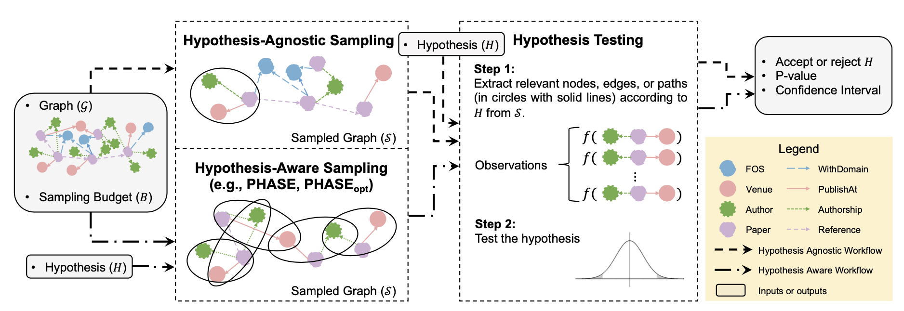
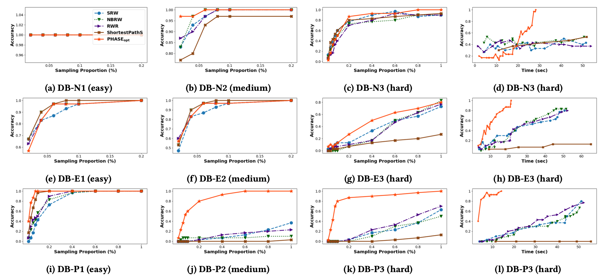
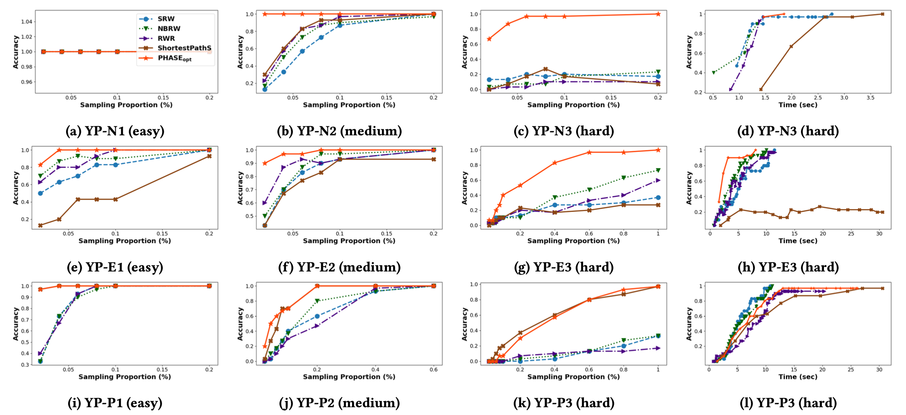

# GraphHT: A Sampling-based Framework for Hypothesis Testing on Large Attributed Graphs

**Yun Wang**, **Chrysanthi Kosyfaki**, **Sihem Amer-Yahia**, **Reynold Cheng**

[**[Paper]**](#) **[Code](https://github.com/Carrieww/GraphHT)**



Hypothesis testing is a statistical method used to draw conclusions about populations from sample data. While traditionally applied to tabular data, the prevalence of graph representations in real-life applications calls for efficient hypothesis testing methods on graphs.

**GraphHT introduces a novel sampling-based framework for hypothesis testing on large attributed graphs.**

## Key Features

- **Efficient Sampling**: Our framework provides efficient sampling methods for large attributed graphs
- **Hypothesis Testing**: Support for various hypothesis testing scenarios on nodes, edges, and paths
- **PHASE Sampler**: A novel Path-Hypothesis-Aware SamplEr using m-dimensional random walks
- **Optimized Implementation**: Includes both basic and optimized versions (PHASE<sub>opt</sub>) of the sampler

## Experimental Results

Our comprehensive experiments demonstrate the effectiveness of our approach:

### DBLP Dataset Performance


### Yelp Dataset Performance


## Citation

```bibtex
@article{wang2024sampling,
  title={A Sampling-based Framework for Hypothesis Testing on Large Attributed Graphs},
  author={Wang, Yun and Kosyfaki, Chrysanthi and Amer-Yahia, Sihem and Cheng, Reynold},
  journal={[Journal Name]},
  year={2024}
}
```

## Contact

For questions and feedback, please contact [carrie07@connect.hku.hk](mailto:carrie07@connect.hku.hk) 